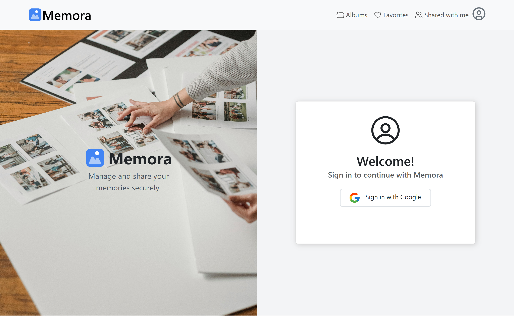
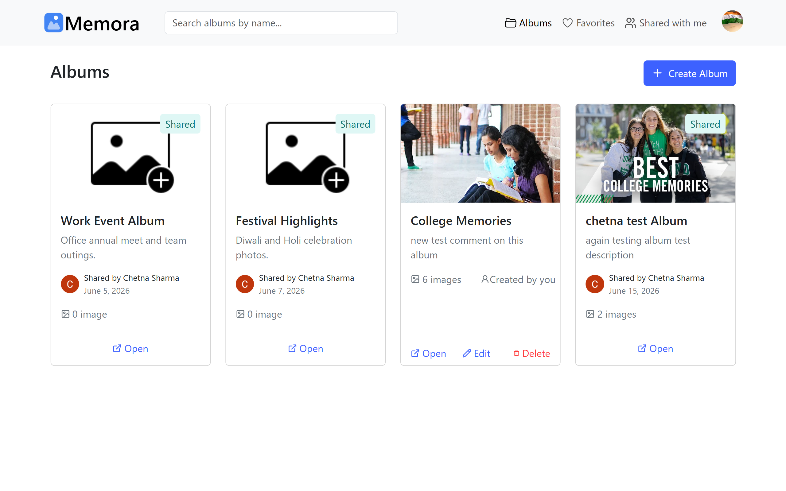
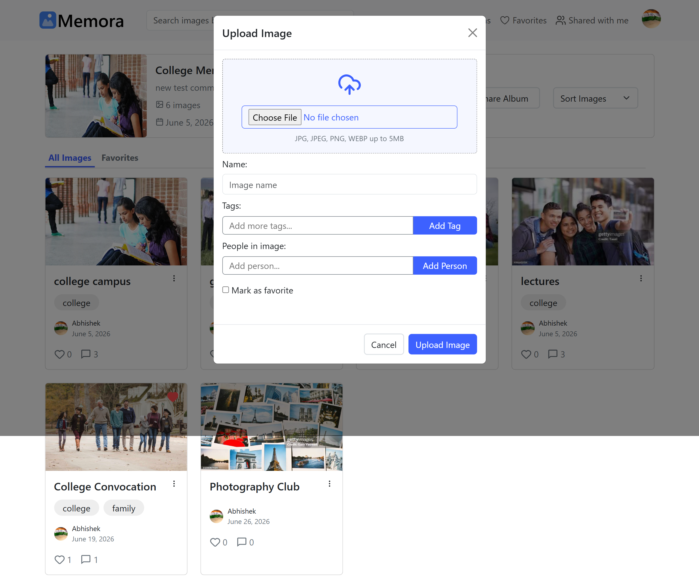
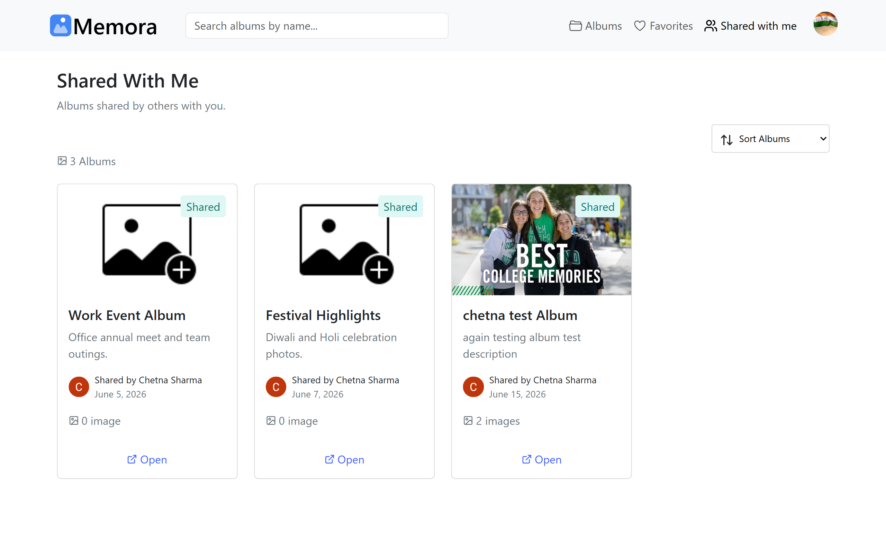
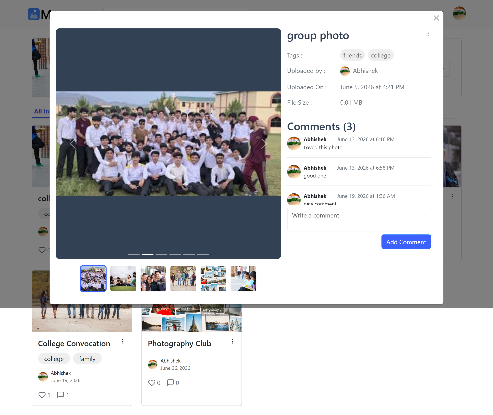

# Memora

A full-stack cloud-based photo management application featuring secure authentication, image uploads, album organization, collaborative sharing, and cloud storage integration.<br>
Built with a React frontend, Express/Node backend, MongoDB database, and Cloudinary.

---

## Tech Stack

**Frontend**
- React.js
- React Router DOM
- JavaScript (ES6+)
- React Icons
- Axios
- Bootstrap5
- HTML5 & CSS3
- React-Toastify

**Backend**
- Node.js
- Express.js
- Google OAuth
- RESTful APIs
- Cloudinary

**Database**
- MongoDB

---

## Live Demo

[Live Application](https://memora-frontend-ashy.vercel.app)<br><br>

[Project Walkthrough](YOUR_VIDEO_LINK)<br><br>

[Backend Repository](https://github.com/Abhishek-Das251002/Memora-Backend)

---

## Screenshots

### Login



### Home



### Upload Images



### Albums


### Shared Albums



### Image Viewer



---

## Features

**Authentication**

- Secure user authentication using Google OAuth
- Protected application routes

**Photo Management**

- Upload and organize images into albums
- Store images securely using Cloudinary
- View images in an interactive gallery

**Album Management**

- Create and organize photo albums
- Rename and delete albums

**Collaboration**

- Share albums with other registered users
- Manage shared album access
- View albums shared by other users

**User Experience**

- Responsive interface across devices
- Loading indicators during asynchronous actions
- Toast notifications for success and error states

---

## Quick Start

```bash
git clone https://github.com/Abhishek-Das251002/Memora-Frontend.git

cd Memora-Frontend

npm install

npm run dev
```

---

## Environment Setup

Create a `.env` file in the backend root directory and add the following environment variables:

```env
PORT=3000

MONGODB_URI=your_mongodb_atlas_connection_string

JWT_SECRET=your_jwt_secret

FRONTEND_URL=your_frontend_url

GOOGLE_CLIENT_ID=your_google_client_id

GOOGLE_CLIENT_SECRET=your_google_client_secret

CLOUDINARY_CLOUD_NAME=your_cloudinary_cloud_name

CLOUDINARY_API_KEY=your_cloudinary_api_key

CLOUDINARY_API_SECRET=your_cloudinary_api_secret
```

---

## Deployment

| Service | Platform |
|---------|----------|
| Frontend | Vercel |
| Backend | Vercel |
| Database | MongoDB Atlas |
| Image Storage | Cloudinary |

---

## API References

### **GET /auth/google**

Initiate Google OAuth authentication.

### **GET /auth/google/callback**

Handle the Google OAuth callback and authenticate the user.

### **POST /albums**

Create a new album.

### **POST /albums/:albumId/images**

Upload images to Cloudinary.

### **GET /albums**

Retrieve all user albums.

### **POST /albums/:albumId/share**

Share an album with another user.

---

> **Note:** Detailed API request and response payloads are available in the [backend repository](https://github.com/Abhishek-Das251002/Memora-Backend).

---

## Future Improvements

- Support drag-and-drop image uploads.
- Enable album cover customization.

---

## Contact

If you have any questions or would like to discuss this project, feel free to connect with me.

**Email:** [abhishekgautam1966@gmail.com](mailto:abhishekgautam1966@gmail.com)<br><br>

**LinkedIn:** [Abhishek Gautam](https://www.linkedin.com/in/abhishek-gautam-dev)
